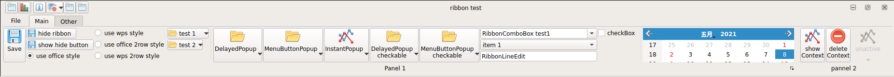
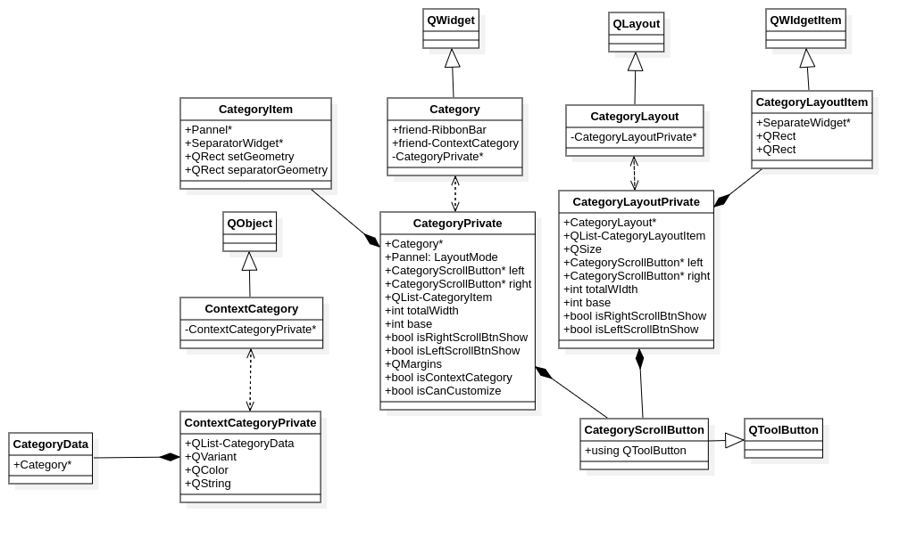

### 简介
本项目是Qt5-UI实践，仿造Office和WPS风格，创建类似丝带（Ribbon）风格的组件和布局。
主要组件为菜单栏（RibbonBar）、应用按钮（ApplicationButton）、Tab工具栏（TabBar）、快捷工具栏
(QuickAccessBar)、主窗体按钮（WindowButton）、无边框窗体（Frameless Window）、组件类别（Category）
、面板（Pannel）和组件画廊（Gallery）。

本项目主要学习自[SARibbon](https://github.com/czyt1988/SARibbon)开源项目，并给出了自己的一些理解。

### 内容展示
+ 主页工具栏展示

+ 其他页工具栏展示

### 主要结构
+ 主要的布局结构

+ 项目中组件的继承关系
    + Gallery相关组件的关系
    

    + Category相关组件关系
    
    
    + RibbonBar相关组件的关系
    

### 实现工具
Clion 2019 + Qt5 核心组件

### 参考项目
+ [SARibbon项目](https://github.com/czyt1988/SARibbon)

### 协议
MIT License